# Ball Sort

An engine based around the Ball Sort puzzle games.

# Status




[Coverage Report](https://stevehjohn.github.io/BallSort/)

# Developer Notes

## Data Format

Puzzle is sent down from left to right column wise, bottom to top row wise.

## Colours

```
1 = Red
2 = Green
3 = Yellow
4 = Blue
5 = Orange
6 = Dark Purple
7 = Cyan
8 = Purple
9 = Light Green
10 = Pink
11 = Dark Green
12 = Lilac
```
